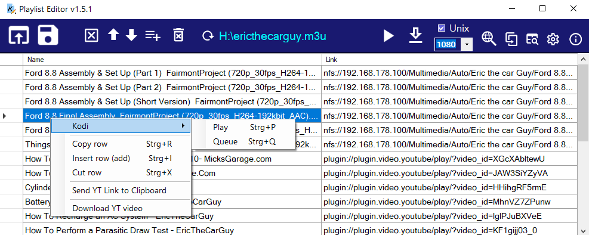
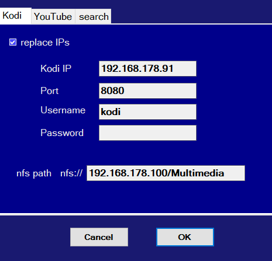
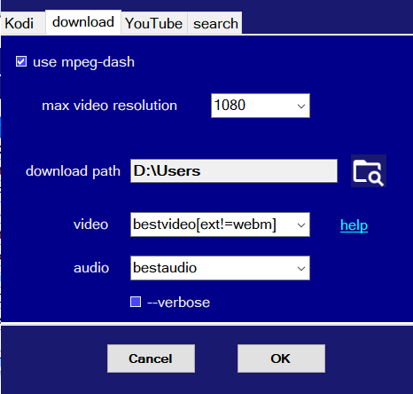

# Playlist Editor (for Kodi video m3u files)
Editor for Kodi video playlist files .m3u for Windows with send link to Kodi and play with VLC player, download with youtube-dl (with MPEG-DASH).
A version for IPTV files: [PlaylistEditorTV](https://github.com/Isayso/PlaylistEditorTV)

- You can edit and create Kodi video playlists, add, rename, move and delete playlist entries, drag&drop video files and m3u files to add to list. Search for names and find duplicate links to merge files. Copy/paste links to other editor instance. A copy link to clipboard with a delayed loop for JDownloader is integrated. 
Send or queue links to the connected Kodi device.
Play links on Windows with installed VLC player or download with youtube-dl / ffmpeg.



- YouTube links from clipboard can be added with a own defined hotkey to playlist.
- You can add local files and automatic replace the IPs for your Kodi linux device and nfs path for NAS drives.

 


## Getting Started

At the moment there is only the compiled EXE file [released](https://github.com/Isayso/PlaylistEditor/releases) on the respository. 


### Prerequisites

- Windows with .NET Framework 4.6.2. 
- VLC player recommended.
- youtube-dl and ffmeg for download YT videos


### Installing

Unzip and run the exe file. No install necessary.


```
PlaylistEditor.exe
```


You can connect the .m3u filename extension with the program or open files with drag and drop on the icon.

### New spin-off for IPTV lists

go to [PlaylistEditorTV](https://github.com/Isayso/PlaylistEditorTV) in other repository


## Built With

* [Visual Studio 2017](https://visualstudio.microsoft.com/) - C# with .NET 4.6.2


## License

This project is licensed under the GPL 3 License - see the [LICENSE](LICENSE) file for details

## Acknowledgments

* Inspired from various IPTV editors for Kodi
* the youtube-dl team
* ffmpeg developers
* vlc player

Thank you for their great work!

