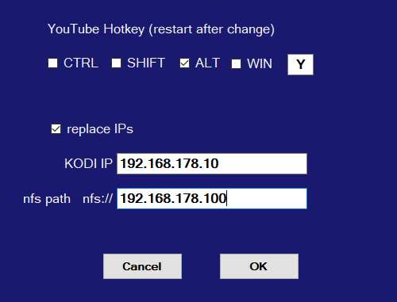

# Playlist Editor
Simple editor for Kodi playlist video files .m3u for Windows.
- You can edit and create Kodi video playlists, add, rename, move and delete playlist entries, drag&drop video files and m3u files to add to list.


- YouTube links from clipboard can be added with a own defined hotkey to playlist.
- You can add local files and automatic replace the IPs for your Kodi linux device and nfs drives like NAS drives.




## Getting Started

At the moment there is only the compiled EXE file [released](https://github.com/Isayso/PlaylistEditor/releases) on the respository. The code will be distributed some days later after feature update coming soon, version 1.2


### Prerequisites

Windows with .NET Framework 4.6.2


### Installing

Unzip and run the exe file. No install necessary.


```
PlaylistEditor.exe
```


You can connect the .m3u filename extension with the program or open files with drag and drop on the icon.


## Built With

* [Visual Studio 2017](https://visualstudio.microsoft.com/) - C# with .NET 4.6.2


## License

This project is licensed under the MIT License - see the [LICENSE](LICENSE) file for details

## Acknowledgments

* Inspired from various IPTV editors for Kodi

