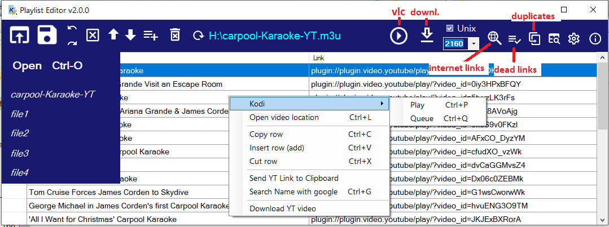
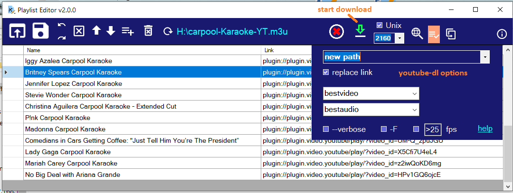

# Playlist Editor for Kodi
Windows Editor/Player for Kodi playlist files (.m3u) with send link to Kodi and play with VLC, download of youtube videos with youtube-dl. 
Import links from internet, other players or local storage devices (NAS).   
NEW: Import of links from [VideoLinkSafe](https://github.com/Isayso/VideoLinkSave) via Hotkey.

Can be used as an offline Youtube link storage for Windows.

A version for IPTV files: [PlaylistEditorTV](https://github.com/Isayso/PlaylistEditorTV)
 
 

 
 
- NEW 2.1 AIMP playlist import
- Check for valid links button, search for Name field with google, enter the fps value for download. 
light orange: Link or video not avaliable, Light grey: file could not be checked.
- You can edit and create Kodi video playlists, add, rename, move and delete playlist entries, drag&drop video files and m3u files to add to list. 
- YouTube links and all other Kodi supported html links from clipboard can be added with a own defined hotkey to playlist, or send to your Kodi device without the editor. 
- Search for names and find duplicate links to merge files. 
- Copy/paste links to other editor window. 
- A copy link to clipboard with a delayed loop for JDownloader is integrated. 
- Send or queue links to the connected Kodi device.
- Play links on Windows with installed VLC player 
- download with youtube-dl / ffmpeg and automatic replace the link
- support for NAS/nfs device
- You can add local files and automatic replace the IPs for your Kodi linux device and nfs path for NAS drives.




 
 


## Keyboard shortcuts
- F2 to edit cell
- Ctrl + C copy row
- Ctrl + V paste row
- Ctrl + X cut row
- Ctrl + F find string
- Ctrl + N open new window
- Ctrl + O open file dialog
- Ctrl + S save
- Ctrl + G search with google
- Ctrl + P send link to Kodi (IP in settings)
- Ctrl + Q send link to Kodi queue
- Ctrl + L open link in explorer or browser
- Ctrl + +/- change font size
- Ctrl + 1/2 move up/down line
- del delete selected row

## Double Click Events
- Double on Background --> open file dialog
- Double on Grid Cell --> play in vlc
- Double + Ctrl on Grid Cell --> play on Kodi
- Double + Ctrl + Shift --> queue on Kodi

## Getting Started

At the moment there is only the compiled EXE file [released](https://github.com/Isayso/PlaylistEditor/releases) on the respository. 


### Prerequisites

- Windows with .NET Framework 4.6.2. 
- VLC player recommended.
- [youtube-dl](https://github.com/ytdl-org/youtube-dl/releases) and ffmeg for download YT videos  


### Installing

Unzip and run the exe file. No install necessary.


```
PlaylistEditor.exe
```


You can connect the .m3u filename extension with the program or open files with drag and drop on the icon.


### Spin-off for IPTV lists

go to [PlaylistEditorTV](https://github.com/Isayso/PlaylistEditorTV) in other repository

## Troubleshooting

If Playlist Editor refuses to start, go to C:\Users\.....\AppData\Local\GitHub_Isayso and delete the entries. 
Win+R: "appdata"

## Built With

* [Visual Studio 2019](https://visualstudio.microsoft.com/) - C# with .NET 4.6.2


## License

This project is licensed under the GPL 3 License - see the [LICENSE](LICENSE) file for details

## Acknowledgments

* Inspired from various IPTV editors for Kodi
* the youtube-dl team
* ffmpeg developers
* vlc player

Thank you for your great work!


