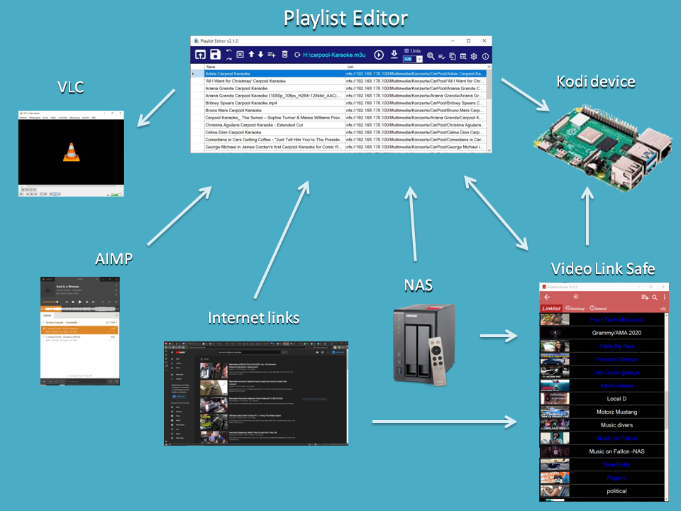

# Playlist Editor for Kodi

2.2.3 better undo/redo UI, better find UI, fixes


Windows Editor/Player for Kodi playlist files (.m3u) with send link to Kodi and play with VLC.
Import links from internet, other players or local storage devices (NAS).   
NEW: Import of links from [VideoLinkSafe](https://github.com/Isayso/VideoLinkSafe) via Hotkey.

Can be used as an offline Youtube link storage for Windows.

A version for IPTV files: [PlaylistEditorTV](https://github.com/Isayso/PlaylistEditorTV)  
Source code in other repository [PlaylistEditor2](https://github.com/Isayso/PlaylistEditor2)
 
 

 


 


## Keyboard shortcuts
- F2 to edit cell
- Ctrl + C copy row
- Ctrl + V paste row
- Ctrl + X cut row
- Ctrl + F find string
- Ctrl + N open new window
- Ctrl + O open file dialog
- Ctrl + S save
- Ctrl + G search with google
- Ctrl + P send link to Kodi (IP in settings)
- Ctrl + Q send link to Kodi queue
- Ctrl + L open link in explorer or browser
- Ctrl + +/- change font size
- Ctrl + 1/2 move up/down line
- del delete selected row

## Double Click Events
- Double on Background --> open file dialog
- Double on Grid Cell --> play in vlc
- Double + Ctrl on Grid Cell --> play on Kodi
- Double + Ctrl + Shift --> queue on Kodi

## Getting Started

At the moment there is only the compiled EXE file [released](https://github.com/Isayso/PlaylistEditor/releases) on the respository. 


### Prerequisites

- Windows with .NET Framework 4.6.2. 
- VLC player recommended.


### Installing

Unzip and run the exe file. No install necessary.


```
PlaylistEditor.exe
```


You can connect the .m3u filename extension with the program or open files with drag and drop on the icon.


### Spin-off for IPTV lists

go to [PlaylistEditorTV](https://github.com/Isayso/PlaylistEditorTV) in other repository

## Troubleshooting

If Playlist Editor refuses to start, go to C:\Users\.....\AppData\Local\GitHub_Isayso and delete the entries. 
Win+R: "appdata"

## Built With

* [Visual Studio 2019](https://visualstudio.microsoft.com/) - C# with .NET 4.6.2


## License

This project is licensed under the GPL 3 License - see the [LICENSE](LICENSE) file for details

## Acknowledgments

* Inspired from various IPTV editors for Kodi
* [YoutubeExplode](https://github.com/Tyrrrz) 
* BetterFolderBrowser by Willy-Kimura 
* Fody by Fody
* Anglesharp by Anglesharp
* ffmpeg developers
* vlc player

Thank you for your great work!


